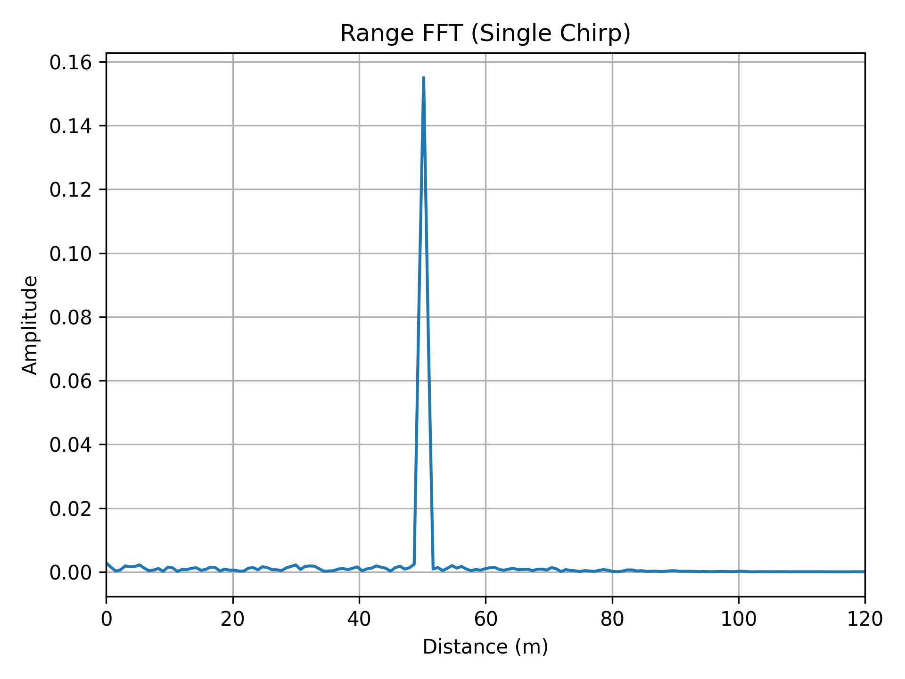
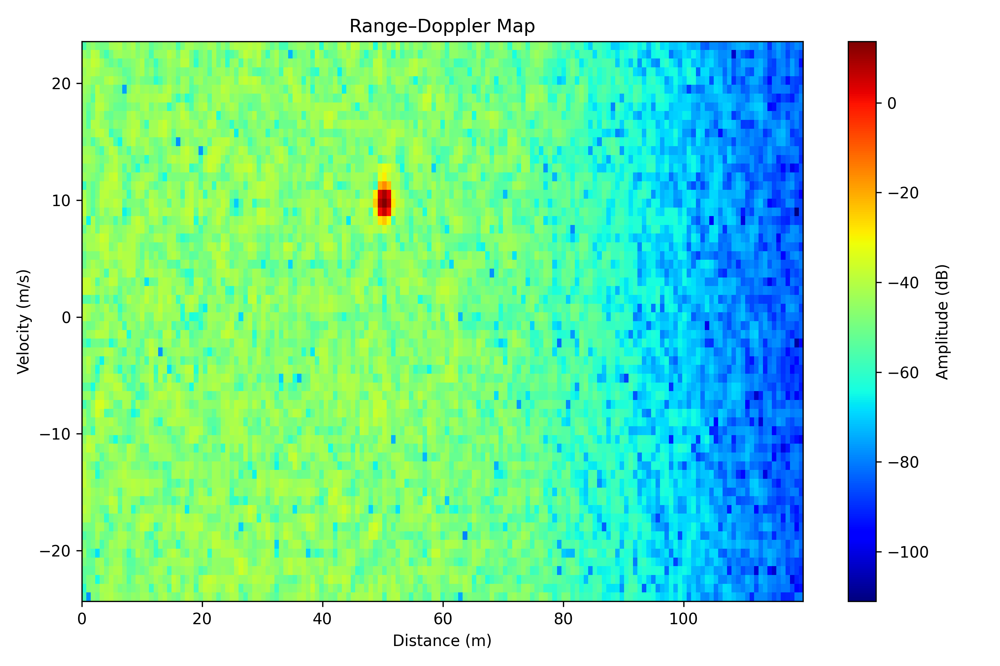
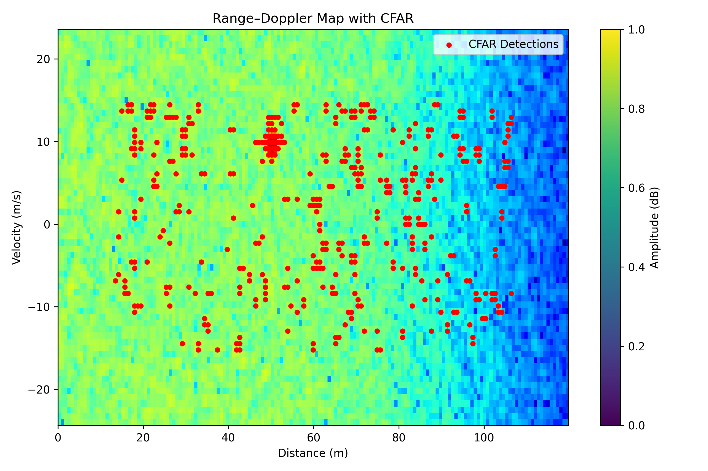

# FMCW Automotive Radar Simulation with CFAR Detection

This project implements a **baseband FMCW (Frequency-Modulated Continuous-Wave) radar signal processing pipeline**, inspired by **automotive radar systems (77 GHz)** used in ADAS applications.

The goal of the project is to simulate the complete radar processing chain — from chirp generation to **Range–Doppler mapping and CFAR-based target detection** — using Python.

Key Features

- FMCW chirp generation (automotive-style waveform)
- Beat signal formation using dechirping (IQ processing)
- Low-pass IF filtering
- Range FFT (fast-time processing)
- Doppler FFT (slow-time processing)
- Range–Doppler map visualization
- 2D CA-CFAR (Constant False Alarm Rate) detection
- Peak picking for final target estimation
- Noise modeling with configurable SNR

# Radar Parameters (Typical Automotive Setup)

| Parameter | Value |
|---------|------|
| Carrier Frequency | 77 GHz |
| Bandwidth | 200 MHz |
| Chirp Duration | 40 µs |
| Sampling Frequency | 20 MHz |
| Number of Chirps | 64 |
| Target Range | ~50 m |
| Target Velocity | ~10 m/s |

---

## Signal Processing Pipeline

1. **Transmit FMCW Chirp**  
   Linear frequency-modulated baseband chirp is generated.

2. **Receive Echo**  
   Time delay models range, Doppler shift models velocity.

3. **Dechirping (Mixing)**  
   Received signal is mixed with the conjugate of the transmit signal.

4. **IF Low-Pass Filtering**  
   Removes high-frequency components after mixing.

5. **Range FFT**  
   Fast-time FFT estimates target distance.

6. **Doppler FFT**  
   Slow-time FFT across chirps estimates velocity.

7. **Range–Doppler Map**  
   2D power map in range–velocity domain.

8. **CFAR Detection**  
   2D CA-CFAR applied on detrended Range–Doppler map.

9. **Peak Picking**  
   Strongest detection selected as final target.

# Example Results

# Beat Signal

# Range FFT

# Range–Doppler Map

# CFAR Detections

---

# CFAR Implementation 

- CA-CFAR is applied in **2D (range × Doppler)**
- Guard cells prevent target self-masking
- Training cells estimate local noise power
- A threshold offset (in dB) controls false alarm rate
- Range-dependent trends are removed prior to CFAR to stabilize detection

---

# Noise Modeling

- Additive white Gaussian noise (AWGN)
- Configurable Signal-to-Noise Ratio (SNR)
- Noise added per chirp before FFT processing

---

# Project Structure

FMCW/
│
├── src/
│ ├── fmcw.py
│ └── fmcwIQ.py
│
├── results/
│ ├── 01_beat_signal.png
│ ├── 02_range_fft.png
│ ├── 03_range_doppler.png
│ └── 04_cfar_detections.png
│
├── README.md
├── requirements.txt
└── .gitignore
